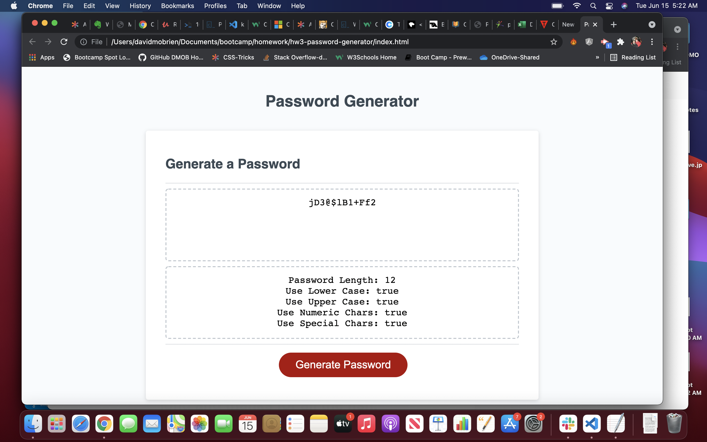

# 03 JavaScript: Password Generator

## Table of Contents
1. [General Info](#general-info)
2. [Screenshot](#screenshot)
3. [Technologies](#technologies)
4. [Installation](#installation)
5. [FAQs](#faqs)
### General Info
***
### David OBrien's Password Generator

Web based password generator application allows user to input length and char types
they would like included in their emitted password. Also displays inputs after password
is generated to facilitate validating output.

### Screenshot

## Technologies
***
A list of technologies used within the project:
  * HTML
  * CSS
  * Javascript

## Installation
***

Link to github repository- https://github.com/dmobrienllc/hw3-password-generator

Link to live site- https://dmobrienllc.github.io/hw3-password-generator/

## FAQs
***

Q Is this application awesome?

A Why yes it is!
---

